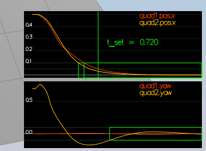

# Building a Controller Writeup

## `GenerateMotorCommands()`

The individual thrusts are calculated by using the equations that define the collective thrust and moments about the x, y, z axes.

F is given by `collThrustCmd` and `tau_x`, `tau_y`, `tau_z` are given by `momentCmd`.

```
F = F1 + F2 + F3 + F4
tau_x = (F1 - F2 - F3 + F4) * l
tau_y = (F1 + F2 - F3 - F4) * l
tau_z = (F1 + F2 + F3 + F4) * l
```
where l is
```
l = L / sqrt(2)
```

After deriving the F1, F2, F3, and F4 from the above equations they are constrained to `minMotorThrust` and `maxMotorThrust` using `CONSTRAIN`. 

In order test this functionality, thrust command equal to the force of gravity was temporarily set in the `AltitudeControl()`.


## `BodyRateControl()`

The desired rotational accelerations along the axis in the body frame are calculated by doing element-wise multiplcation on the difference between `pqrCmd` and `pqr` with the `kpPQR` and moment of interest.

Moment of interest:
```
V3F moi = V3F(Ixx, Iyy, Izz);
```

Additionally, the `kpPQR` in `QuadControlParams.txt` was changed to `87, 87, 5`.


## `RollPitchControl()`

First, the collective thrust was checked to see if it was not a positive number to return 0 pitch and roll rates upfront.
```
  if (collThrustCmd <= 0.0) {
      return V3F(0.0, 0.0, 0.0);
  }
```

Thrust acceleration is obtained by dividing thrust command by the drone mass, which is then used to obtain commanded values for the rotation matrix elements `target_R13` and `target_R23`. Contained to `[-maxTiltAngle, maxTiltAngle]`.

The commanded and actual rotation matrix elements are muliplied with the bank constant
```
kpBank * (R(0, 2) - target_R13)
kpBank * (R(1, 2) - target_R23)
```
Then finally the `p_cmd` and `q_cmd` values are calculated with an expanded equation from the matrix calculation of
```
[[p_cmd], [q_cmd]] = (1 / R33) * [[R21, -R11], [R22, -R12]] @ [[kpBank * (R(0, 2) - target_R13)], kpBank * (R(1, 2) - target_R23)]
```

`kpBank` was increased to `20` for faster roll pitch adjustment.


## `LateralPositionControl()`

This was obtained using the PD with FF approach with some normalizing.

First the velocity,

```
target cmd velocity = k * (position command - position) + velocity command
```
then normalization when above `maxSpeedXY`:
```
  float norm = targetVelCmd.magXY();
  if (norm > maxSpeedXY) {
      targetVelCmd = targetVelCmd * maxSpeedXY / norm;
  }
```

Similarly the target acceleration command is obtained:
```
  float acc_norm = accelCmd.magXY();
  if (acc_norm > maxAccelXY) {
      accelCmd = accelCmd * maxAccelXY / acc_norm;
  }
```

The `kpPosXY` and `kpVelXY` were increased to 3 and 9 respectively for faster correction.


## `AltitudeControl()`

Using the a PID with FF approach, vertical velocity command is calcualted and constrained to `maxDescentRate`
```
float hdotCmd = kpPosZ * (posZCmd - posZ) + velZCmd;
hdotCmd = CONSTRAIN(hdotCmd, -maxDescentRate, maxAscentRate);
```
then acceleration,
```
float accCmd = accelZCmd + kpVelZ * (hdotCmd - velZ);
```

For the integrated portion,
```
integratedAltitudeError = integratedAltitudeError + (posZCmd - posZ) * dt * KiPosZ;
```

Finally we can calculate the thrust with
```
float u_bar = accCmd + integratedAltitudeError;
```

As linear acceleration can be expressed by thrust:
```
[[x_dot_dot], [y_dot_dot], [z_dot_dot]] = [[0], [0], [g]] + R @ [[0], [0], [c]]
```

thrust is 
```
thrust = mass * ((accCmd / R(2, 2)) - 9.81f);
```

then negated (since negative is up!)
```
thrust = -thrust;
```

`kpPosZ`, `kpVelZ`, `KiPosZ` were **not** changed to pass scenario 3. (They are updated for scenario 4.)


## `YawControl()`

A modulus operation is performed on the given yaw command, as factors of 2 pi are irrelevant.

```
float target = fmodf(yawCmd, M_PI * 2);
```

The error is obtained, then standardized to be a positive or negative value under PI.
```
  float error = target - yaw;

  if (error > M_PI) {
      error = error - 2 * M_PI;
  }
  else if (error < -M_PI) {
      error = error + 2 * M_PI;
  }
```

After the `kpYaw` was set to 5.
```
yawRateCmd = kpYaw * error;
```




## Non-ideality and Robustness

Scenario 4 almost worked as is with the solution from Scenario 3. However, the red heavier drone had trouble adjusting in the given time to the specified Z position.

Therefore the `kpPosZ`, `kpVelZ`, `KiPosZ` were bumped to 3, 12 and 60.


